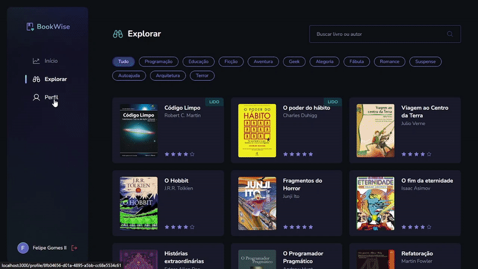

<h1 align="center">
    
</h1>

<br>

### 💻 Book Wise
Book Wise is an application for the user to evaluate books. There, the user can create their evaluation for the available books.
The application has its own database, with a pre-registered list of books. To create reviews, the user must log in, which can be done using Google or GitHub. On the first Login, the user will be automatically registered with the Bank. For other logins, the user's information will already be loaded directly from this Bank.
 
What was developed:

- Advancing in WEB Programming with Nextjs, Javascript and Typescript;
- Social login with Google and GitHub;
- List Books in a database;
- View books and their details;
- Give a rating for the book you want;
- Filter books by categories;
- See other users page and profile;
-  Make evaluations and comments;
-  Search by book or author names;
- Routes;
- Props and components;
- hooks and context;
- Manipulating the DOM, Objects, Arrays and Events;
- Functions Callback;


<br />

## 🧪 Tools

Application developed using the following tools:

- Next
- Stitches
- Next Auth
- Typescript
- Context API
- Radix UI
- Prisma
- React Query
- Axios
- Zod
- Phosphor Icons
  
  <br />
  
- [Design Figma - Book Wise](https://www.figma.com/file/jTau6bMNSF10GkqwYAbuLA/BookWise/duplicate)

## Book Wise Home and Explorer :
 

 ## Book Wise Login and Profile :
 

 <br />


### Programs needed to Getting started

- [NodeJS](https://nodejs.org/en/)
- [Visual Studio Code - Vscode](https://code.visualstudio.com/)
- [Git](https://git-scm.com/)
- [Docker](https://www.docker.com/get-started/)

Clone the project and access the folder

```bash
  # Clone this repository
  $ git clone https://github.com/felipe-gomes-vicente/book-wise.git

  # Access the project folder in your terminal
  $ book-wise

  # Install the dependencies
  $ npm install

  # Make a copy of '.env.local.example' to '.env.local'
  # and set with YOUR environment variables.
  $ cp .env.local.example .env.local

  # Run the application in development mode
  $ npm run dev

  # The application will open on the port: 3000 - go to http://localhost:3000/ or http://127.0.0.1:3000/ 
```


## 📝 License

This project is under the MIT license. See the file [LICENSE](LICENSE) for more details.

---

&nbsp;

<p align="center">Done with 💜 by Felipe Vicente👋</p>

- ## My LinkedIn - [](https://www.linkedin.com/in/felipe-gomes-vicente/)